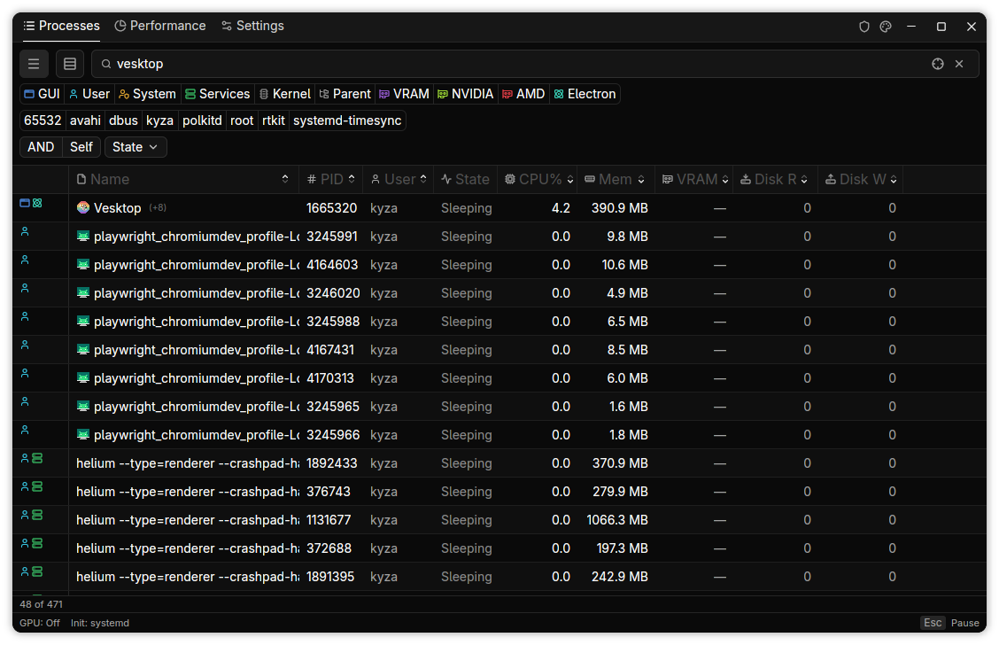
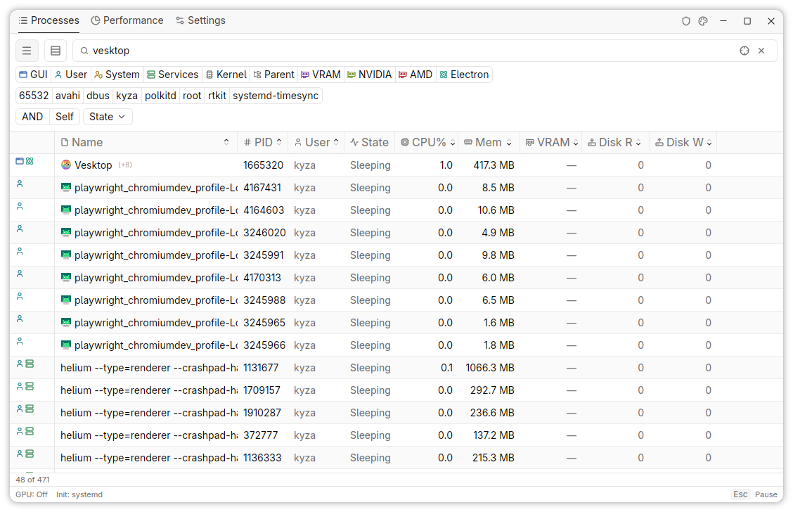
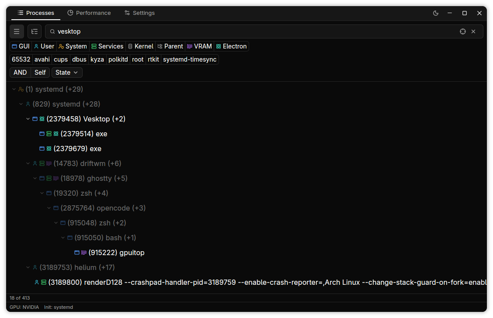
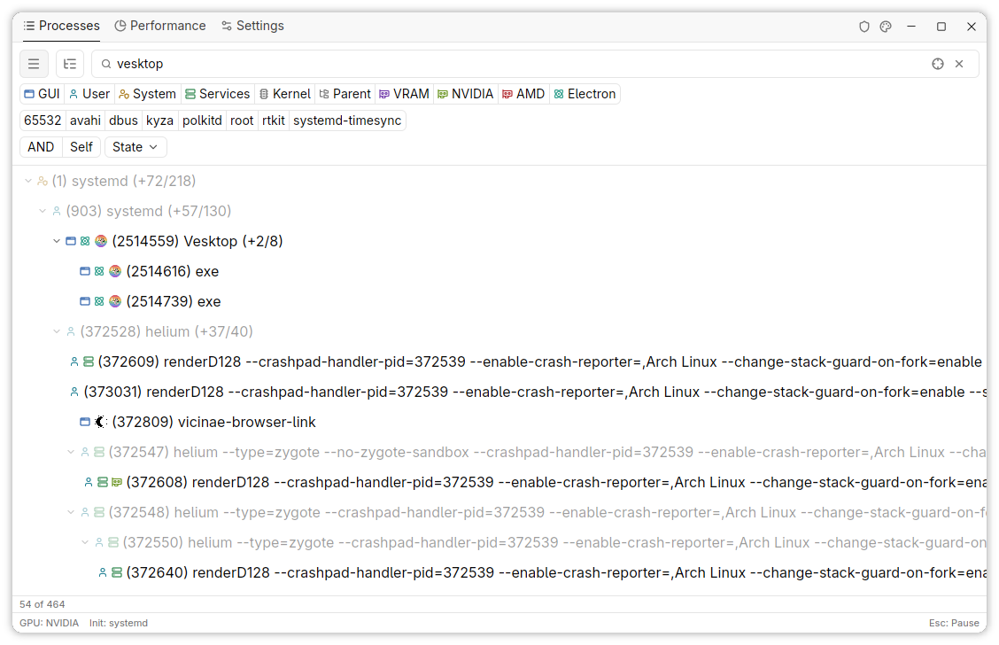
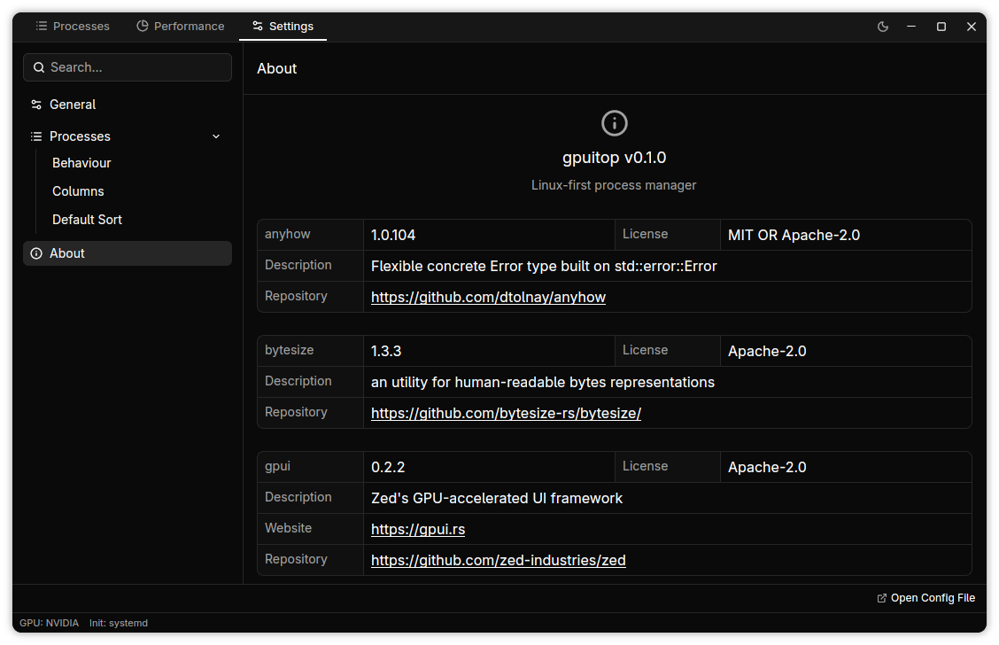
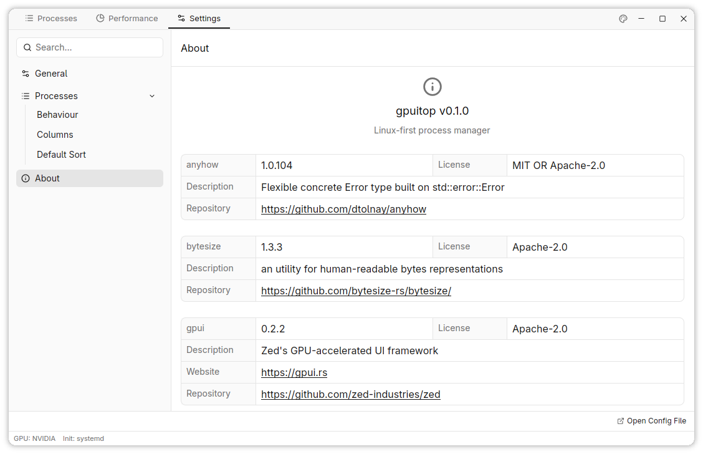

# gpuitop

A GPU-accelerated task manager for Linux built with [GPUI](https://www.gpui.rs/), the Rust UI framework behind the [Zed](https://zed.dev) editor. Fuzzy search, window picking, per-process GPU VRAM tracking (NVIDIA + AMD), and a right-click context menu for signals.

## Screenshots

| Dark | Light |
|------|-------|
|  |  |
|  |  |
|  |  |

> Regenerate with `./screenshots/generate.sh` (requires [driftwm](https://github.com/malbiruk/driftwm)).

## Features

### Find Processes

Fuzzy search the process table, or click **Pick** and switch to any window to jump to its process. Toggle filters to narrow the list: GUI apps, kernel threads, Services, Electron apps, your user, process state (R/S/D/Z/T/I/X), parents, VRAM-consuming processes. Filters combine with AND/OR logic.

The window picker uses the `zwlr_foreign_toplevel_manager_v1` Wayland protocol. It does not work under X11; the Pick button will time out in an X11 session.

### Tree View

Switch between flat list and hierarchical tree view from the toolbar. The tree preserves parent-child relationships and can aggregate resource usage across process subtrees when cumulative mode is on.

### Manage Processes

Right-click any row for a context menu:

- **End Process** (SIGTERM)
- **Force Kill** (SIGKILL)
- **Pause** (SIGSTOP) or **Resume** (SIGCONT)
- **Copy PID** to clipboard
- Send arbitrary signals: SIGHUP, SIGINT, SIGQUIT, SIGUSR1, SIGUSR2

Double-click a process to filter by it. Click column headers to sort by Name, PID, User, State, CPU%, Memory%, VRAM, Disk Read, or Disk Write.

### GPU VRAM Tracking

NVIDIA GPUs are queried through NVML. AMD GPUs use `rocm-smi`. Both backends aggregate across all GPUs and show per-process VRAM usage.

### Electron Detection

Discord, VS Code, and other Electron apps show their real name instead of "electron". The detector walks the process tree to find the root app name.

### System Resources

The Performance tab shows CPU (overall bar + per-core gauges), memory (total, used, available, cached, swap), disk I/O per device, and network throughput per interface.

## CLI

Run `gpuitop -h` for the full usage text.

| Flag | Description |
|------|-------------|
| `-c`, `--config <PATH>` | Load config from file instead of default |
| `--override <RON>` | Partial [RON](https://github.com/ron-rs/ron) merged over loaded config (repeatable) |
| `-p`, `--page <PATH>` | Start on a specific tab: `processes`, `processes.tree`, `processes.list`, `performance`, `settings`, `settings.general`, `settings.processes`, `settings.about` |
| `-s`, `--search <TEXT>` | Pre-fill the process search bar |
| `-v`, `--version` | Print version and exit |
| `-h`, `--help` | Print help and exit |

```
gpuitop --page settings.about
gpuitop --config ~/gaming.ron --override '(general: (interface: (refresh_ms: 500)))'
gpuitop -p processes.tree -s firefox
```

## Prerequisites

- Rust toolchain: [rustup](https://rustup.rs)
- Linux with X11 or Wayland
- GPUI build dependencies:

```bash
# Ubuntu/Debian
sudo apt install build-essential pkg-config cmake \
  libx11-dev libxkbcommon-dev libxkbcommon-x11-dev \
  libwayland-dev libfontconfig-dev libvulkan-dev

# Fedora
sudo dnf install gcc-c++ cmake pkg-config \
  libX11-devel libxkbcommon-devel libxkbcommon-x11-devel \
  wayland-devel fontconfig-devel vulkan-devel

# Arch
sudo pacman -S base-devel cmake pkgconf \
  libx11 libxkbcommon libxkbcommon-x11 \
  wayland fontconfig vulkan-headers
```

- NVIDIA VRAM: NVIDIA driver (NVML bundled with the driver)
- AMD VRAM: `rocm-smi` from the ROCm stack

## Install

```bash
cargo install --git https://github.com/Kyza/gpuitop.git
```

## Config

Stored at `~/.config/gpuitop/config.ron` (respects `XDG_CONFIG_HOME`). Edit from Settings > General and Settings > Processes in the app, or write the RON file directly.

### Available Settings

| Setting | Type | Default |
|---------|------|---------|
| Refresh Rate | u64 | 1500 (ms) |
| Theme | Theme | System (Dark, Light) |
| Window Width | u32 | 1100 |
| Window Height | u32 | 700 |
| VRAM Polling | VramPolling | Auto (On, Off) |
| PID Filter Mode | PidFilterMode | DirectChildren (AllDescendants) |
| Clear Search on Pin | bool | true |
| Resource View | ResourceViewMode | SelfOnly (Cumulative) |
| Default View | DefaultViewMode | List (Tree) |
| Sort Column | SortColumn | Cpu |
| Sort Descending | bool | true |

The 9 process table columns can be reordered and toggled on/off from Settings > Processes.

### [RON](https://github.com/ron-rs/ron) Override

`--override` takes a partial RON struct and deep-merges it into the loaded config. Only the keys you specify change; everything else stays as-is.

```bash
# Change refresh rate and theme
gpuitop --override '(general: (interface: (refresh_ms: 500, theme: Dark)))'

# Set window size
gpuitop --override '(window_size: (1920, 1080))'

# Switch to tree view with cumulative resources
gpuitop --override '(processes: (behaviour: (default_view_mode: Tree, resource_view_mode: Cumulative)))'
```

Multiple `--override` flags stack and later values win for overlapping keys.

## Development

| Component | Status |
|-----------|--------|
| **Platform** | |
| Linux Wayland | Supported, tested |
| Linux X11 | Partial (no window picker), untested |
| Windows | Unsupported |
| macOS | Unsupported |
| **GPU Backend** | |
| NVIDIA (NVML) | Supported, tested |
| AMD (rocm-smi) | Supported, untested |
| **Init System** | |
| systemd | Supported, tested |
| OpenRC | Supported, untested |
| runit | Supported, untested |
| dinit | Supported, untested |
| SysV init | Supported, untested |
| Unknown | Heuristic fallback (ppid 1) |

The codebase uses platform abstraction (`src/data/platform/`) so the process collector, GPU queries, and window picker can be swapped per OS.

### Profiling

Key functions are instrumented with [hotpath](https://crates.io/crates/hotpath). Build with the `hotpath` feature:

```bash
cargo run --features hotpath
```

Run `hotpath console` in another terminal for a live TUI. Sub-features for finer granularity:

```bash
cargo run --features hotpath-cpu,hotpath-alloc
```
